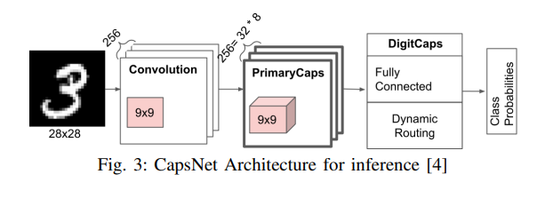

# Presentation [↩](../Contents/BTP.md)

Q. What is FPGA?  
A. A **field-programmable gate array (FPGA)** is a type of integrated circuit that can be programmed or reprogrammed after manufacturing. It consists of an array of **programmable logic block** and **interconnects** that can be configured to perform various digital functions.  
Used in applications where flexibility, speed, and parallel processing capabilities are required, such as in telecommunications, automotive, aerospace, and industrial sectors.

The logic blocks perform :
- complex combinational functions
- act as simple logic gates like AND and XOR. 

In most FPGAs, logic blocks also include memory elements, which may be simple flip-flops or more complete blocks of memory. Allows simultaneous software dev along with hardware dev in embedded systems.

Q. Motivation for CapsNet?  
A. FPGAs provide a low-power and high-performance computing solution, making them suitable for edge devices with constrained power budgets.
- Efficient edge computing
- Real time processing of complex data
  
Provides flexibility in customizing hardware accelerators for specific requirements of the model.
- Low Latency and High Throughput.
- Power efficiency for wearable devices.
- Portability for medical imaging devices.

Other limitations?
- Non FPGA solutions do not have much parallelism.
- Power consumption of them is bad.
- Hardware Design Inflexibility.

## CapsNet
- Pooling layer in CNN causes loss of spatial information. Sabour et al. have proposed a CapsNet in which
  ```
  Neurons are grouped together to form a layer of capsules and have removed the pooling layer by devising a powerful routing algorithm. The algo maps the capsule from a lower layer to an appropriate parent capsule in the layer above.
  Hence it increases the ability to preserve spatial characteristics, improves learning ability of the model, and increase accuracy of the model.
  ```
- However CapsNet has higher MAC/Memory ratio and is more compute-intensive than CNNs.
> Many of the use cases of CapsNet such as healthcare and autonomous vehicles [9] require these networks to run on edge devices that have limited compute resources and work under severe energy constraints. Since CapsNet is a large and highly complex network, accelerating its performance on edge devices can be tremendously challenging.

- In general, to reduce the computation and memory of CNNs,
various model compression techniques and optimization techniques must be used.




- The dynamic routing algorithm maps the
capsule from a lower layer to a particular capsule in a higher
layer with the help of coupling coefficient. An important
advantage of CapsNet is their ability to preserve spatial
information of detected features when performing different
types of recognition tasks.

## Optimization Routing Algorithm
- Dynamic Routing uses exp() and div() frequently.
- By using Taylor expansion, an approximation can of the exponential function can be expressed as a linear function in x.

> *e<sup>x</sup>* = *e<sup>a</sup>(b + x(c + x(d + x(e + x(f + g)))))*  
> a/b = e<sup>log a - log b</sup>

- Optimization techniques used:
  - Loop reordering
  - Vivado HLS Pragma directives
  - Processing Elements (?) / P.E

## Architecture and Dynamic Algo
- It consists of the following three layers: 
  - Convolution (9x9 convolution/256 output channels
  - PrimaryCaps (9x9 convolution/256 output channels divided into 32 8-dimensional capsules)
  - DigitCaps (fully-connected 16-dimensional capsules)  
  - 
The dynamic routing algorithm is used between PrimaryCaps and DigitCaps. It measures the agreement between capsules present in layer *l* and layer *l+1*. The input to the algorithm, *u<sub>j/i</sub>*, is the prediction vector for capsule *j* in layer *l+1* made by capsule *i* in layer *l*. The algorithm initializes the logits *b<sub>ij</sub>* to zero and computes the coupling coefficient *c<sub>ij</sub>* for all mapping between capsule *i* in layer *l* and capsule *j* in layer *l+1*. The coupling coefficients are then refined by measuring the agreement between the output *v<sub>j</sub>* of each capsule in layer *l+1* and the prediction vector *u<sub>j/i</sub>*.  
Taking the hardware perspective into consideration, these iterative computations become challenging as parallelization on a large scale is difficult.