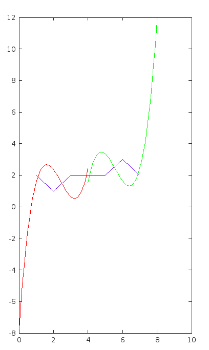

# Today's notes

```Matlab
clc 
clear all

x1 = [1 2 3 4];
x2 = [4 5 6 7];

y1 = [2 1 2 2];
y2 = [2 2 3 2];

% 3rd degree; p(x) = x^3 + a*x^2 + b*x + c
A1 = [x1'.^2 x1 ones(4,1)];
B1 = y1'-x1'.^3;
coeff1 = linsolve(A1,B1);

A2 = [x2'.^2 x2 ones(4,1)];
B2 = [y2'-x2'.^3];
coeff2 = linsolve(A2,B2);

x1s = 0:0.1:4;
x2s = 4:0.1:8;
y1s = coeff1(1)*x1s.^3 + coeff1(1)*x1s.^2 + coeff1(2)*x1s + coeff1(3);
y2s = coeff2(1)*x2s.^3 + coeff2(1)*x2s.^2 + coeff2(2)*x2s + coeff2(3);

plot(x1,y1,'b'); hold on;
plot(x2,y2,'b');

plot(x1s,y1s,'r');
plot(x2s,y2s,'g');
```

**The result image is:**  

> [!NOTE]
> This plot will not work the work we intend it to (something to do with splines or so). Manipulations inside the Matlab software will be required to make the plot continuous.

### Checking for the velocity:
```Matlab
y1s_d = 3*coeff1(1)*x1s.^2 + 2*coeff1(1)*x1s + coeff1(2);
y2s_d = 3*coeff2(1)*x2s.^2 + 2*coeff2(1)*x2s + coeff2(2);

plot(x1s,y1s_d,'m');
plot(x2s,y2s_d,'k');
```
- This plots the slope of the curve at each point.

### Things with Torus.