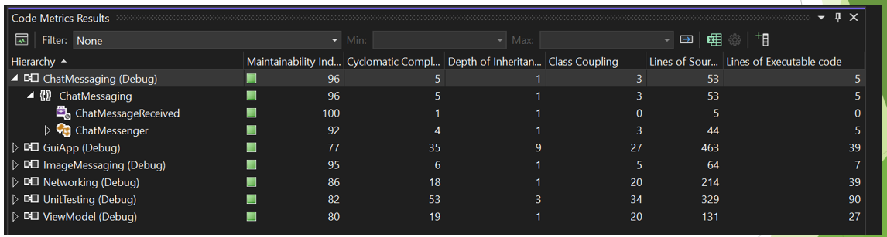

# Coding Standards [↩](../Contents/SE.md)
- Coding conventions
    - [Framework Design Guidelines](https://learn.microsoft.com/en-us/dotnet/standard/design-guidelines/)
    - [C# Coding Conventions](https://learn.microsoft.com/en-us/dotnet/csharp/fundamentals/coding-style/coding-conventions)
    - [Common C# Coding Conventions](https://learn.microsoft.com/en-us/dotnet/csharp/fundamentals/coding-style/coding-conventions)
    - [Naming Guidelines](https://learn.microsoft.com/en-us/dotnet/standard/design-guidelines/naming-guidelines)
- Visual Studio
    - [EditorConfig Settings](https://learn.microsoft.com/en-us/visualstudio/ide/create-portable-custom-editor-options?view=vs-2022)
- Static Code Analysis
    - [Code Analyzers](https://learn.microsoft.com/en-us/dotnet/framework/code-analyzers)
    - [Code Analysis](https://learn.microsoft.com/en-us/dotnet/fundamentals/code-analysis/overview?tabs=net-7)
    - [.NET Analyzers](https://github.com/DotNetAnalyzers)
- Additional Checks:
    - Comments, XML documentation
    - Cyclomatic complexity
    - [Debug,Assert](https://learn.microsoft.com/en-us/dotnet/api/system.diagnostics.debug.assert?view=net-7.0), [Trace Logging](https://learn.microsoft.com/en-us/dotnet/core/diagnostics/logging-tracing)

## Code metrics
- Provides devs better insight into the code they're developing.
- Understandable which types and/or methods should be reworked or more thouroughly tested.
- Identify potential risks, understand current state of a project and track progress during software development.

## Testing
**4 Types of Testing**:
- Unit Tests
- Integration Tests
- End-End Tests
- Stress Tests

**Mock-object testing**: Objects are substituted and simulated that the component in test deals with. Is done to enable testing various scenarios. [MOQ](https://github.com/devlooped/moq) is one such framekwork.

## Testing Focus
1. **Functionality**: This testing ensures that the software functions as expected according to the specifications and requirements. Test cases are designed to verify that all features and functions operate correctly, producing the intended results.

2. **Error**: Error testing focuses on identifying and handling various types of errors, exceptions, and faults that may occur during the execution of the software. This includes verifying error messages, error handling procedures, and the system's ability to gracefully recover from errors.

3. **Performance**: Performance testing assesses the software's speed, responsiveness, scalability, and resource usage under different conditions and workloads. This includes tests for load, stress, and endurance to ensure that the system can handle the expected volume of users and data without significant degradation in performance.

4. **Globalization**: This testing evaluates how well the software supports different languages, cultural conventions, and regional preferences. It ensures that the application can handle various character sets, date and time formats, and other internationalization requirements.

5. **Security**: Security testing aims to identify vulnerabilities and weaknesses in the software that could be exploited by malicious users. It involves assessing the system's ability to protect data, enforce access controls, and prevent unauthorized access or attacks.

6. **User experience**: User experience testing focuses on evaluating the software from the perspective of the end user. It assesses the usability, intuitiveness, and overall satisfaction of the user interface, ensuring that the software is easy to use and provides a positive user experience.

7. **Stress / Durability / Reliability**: These tests assess the system's ability to handle high loads, large volumes of data, and continuous operation without failure or data loss. They ensure that the software remains stable and reliable even under demanding conditions.

8. **Portability**: Portability testing checks whether the software can be easily adapted and run on different operating systems, environments, and devices without any significant modifications or issues.

9. **Localization**: Localization testing verifies that the software can be adapted to different locales and cultures by checking its support for specific languages, currencies, and regional preferences.

10. **Smoke**: Smoke testing is a preliminary test to check whether the critical functionalities of the software are working fine. It aims to determine if the application is stable enough for further, more rigorous testing.

11. **Boundary**: Boundary testing checks the software's behavior at the boundaries of input domains. It verifies how the software handles boundary values, including the minimum and maximum values of input data.

12. **Cost / Resources**: Cost and resource testing assess the software's resource consumption, including memory, CPU usage, and network bandwidth, to ensure that it operates efficiently and does not impose excessive costs on the system.

13. **Maintenance**: Maintenance testing evaluates the software's maintainability and the effort required to support and update it. It includes analyzing factors such as lines of code in a function, componentization, and cyclomatic complexity to assess the software's ease of maintenance and future scalability.

>**Globalization** focuses on making the software adaptable and accessible to a global audience, while **localization** involves customizing the software to meet the specific needs and preferences of users in a particular locale or region. 