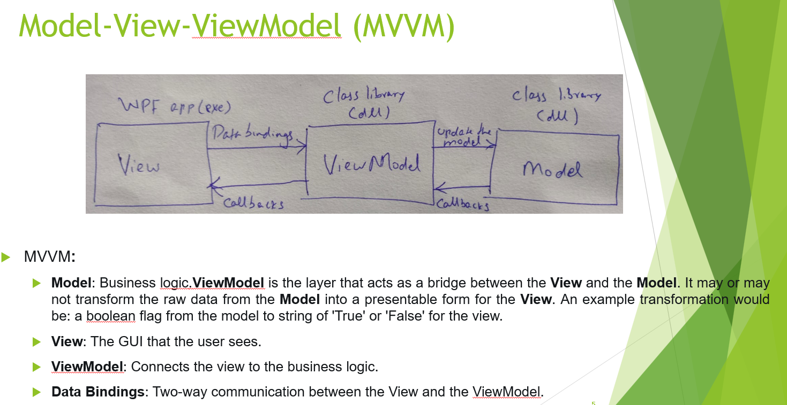

# Graphical User Interface (GUI) [↩](../Contents/SE.md)

There are various UI frameworks such as MFC (Microsoft Presentation Class), `WPF (Windows Presentation Foundation)`, WinUI 3, etc.

WPF is a UI framework that is used for creating desktop client applications.  
XAML is a declarative language that's based on XML, used extensively to build UX.
Refer: 
- WPF : [Getting started with WPF](https://docs.microsoft.com/en-us/visualstudio/designers/getting-started-with-wpf?view=vs-2022)
- XAML : [XAML Tools Overview](https://docs.microsoft.com/en-us/visualstudio/xaml-tools/xaml-overview?view=vs-2022)

## GUI Design Patterns
- [Model-View-Controller (MVC)](https://docs.microsoft.com/en-us/visualstudio/xaml-tools/xaml-overview?view=vs-2022)
- [Model-View-Presenter (MVP)](https://docs.microsoft.com/en-us/visualstudio/xaml-tools/xaml-overview?view=vs-2022)
- [Model-View-ViewModel (MVVM)](https://docs.microsoft.com/en-us/visualstudio/xaml-tools/xaml-overview?view=vs-2022)

### Pros : 
- Business logic is separated from UI. (Model <-> View)
- ViewModel and Model can be unit tested independant of the View, as the latter can be also be remodelled.
- Design and development can go in parallel, and mostly independant of each other.   Design-View **|||** Devs-viewModel+Model.

### Cons :
- Overkill for smaller apps.
- Complex data bindings are hard to debug.

## Core principles
- Keep UI responsive. 
- Access UI elements only on the UI thread.

## References :
- [Keep UI responsive - Microsoft Docs](https://docs.microsoft.com/en-us/windows/uwp/debug-test-perf/keep-the-ui-thread-responsive)
- [Calling Sync Methods Async - Microsoft Docs](https://docs.microsoft.com/en-us/dotnet/standard/asynchronous-programming-patterns/calling-synchronous-methods-asynchronously)
- [GUI Demo - Github](https://github.com/chittur/distributed-and-gui-demo)
- [MVVM Custom-bind Design Demo - Github](https://github.com/chittur/mvvm-custom-binding)

