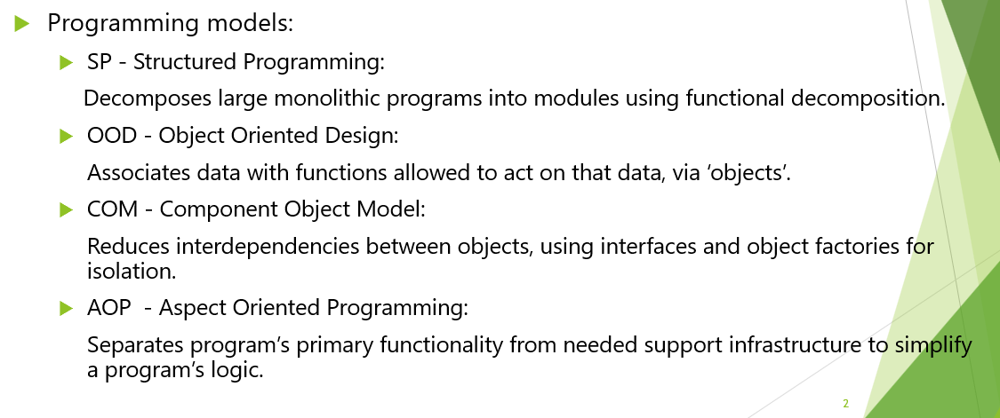
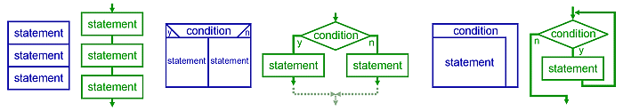
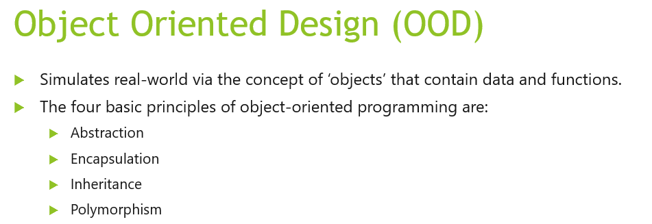
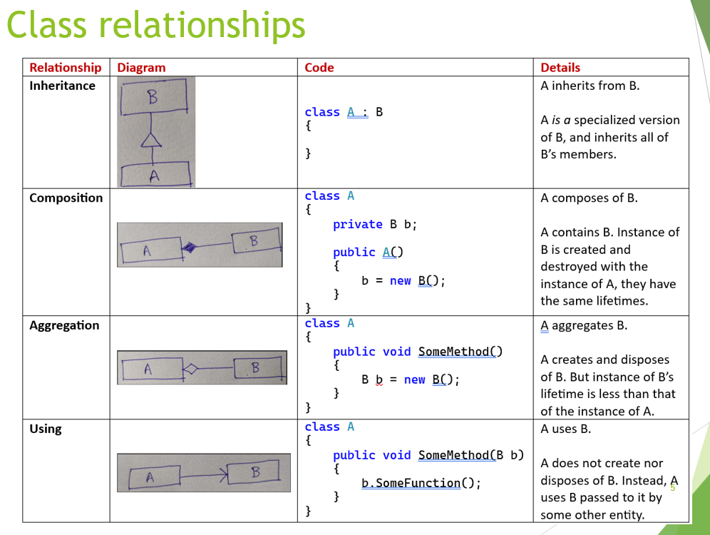

# Object Oriented Design [↩](../Contents/SE.md)
The goal of programming models is to improve the management of large software systems.

### 1. Structured Programming
**Languages** : ALGOL, Pascal, Ada  
**3 control statements** : *Sequence*, *Selection*, *Iteration*

### 2. Aspect Oriented Programming (AOP) 
Refer [↗](https://en.wikipedia.org/wiki/Aspect-oriented_programming#Motivation_and_basic_concepts) for basic concept.

### 3. Object Oriented Design (OOD)

---

## 5 Principles of Class Design - SOLID
- `Single Responsibility` : Every class should have only one responsiblity (only one reason to change).
- `Open-closed` : Open for extension, closed for modification.
- `Liskov Substituition` : Derived classes must be substitutable for their base classes. Clients that use pointers to base classes must be able to use objects of the derived classes without knowing it.
- `Interface Segregation` : Clients shouldn't need to depend upon interfaces that they don't use. Make interface fine-grained and client-specific.
- `Dependancy Inversion` : Use abstractions, promote loose coupling.  

> Loose coupling is an approach to interconnecting the components in a system, network or software application so that those components, also called elements, **depend on each other to the least extent practicable**. Coupling refers to the degree of direct knowledge that one element has of another.

### Class relationships

Software contracts exist to promote componentization to develop independently and concurrently. This is implemeneted via `interfaces`.

Example:
*User interface* <-> **Communication interface** <-> *Networking*.  
The contract merely includes **SEND** and **RECEIVE**.
