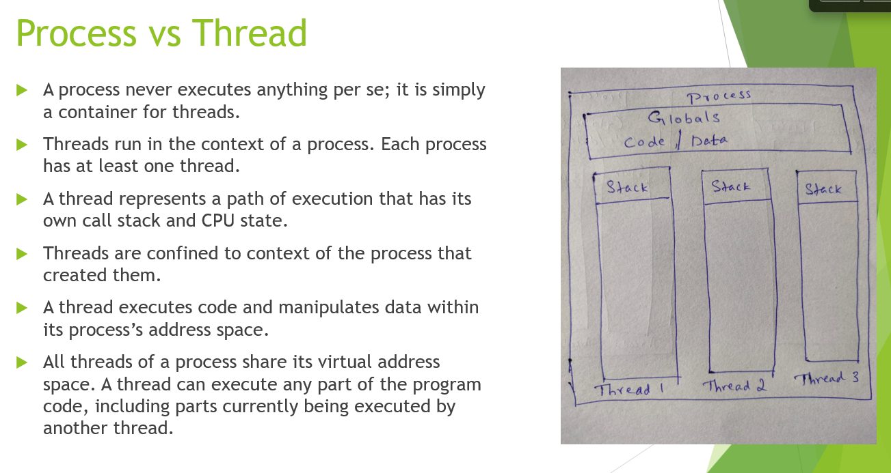
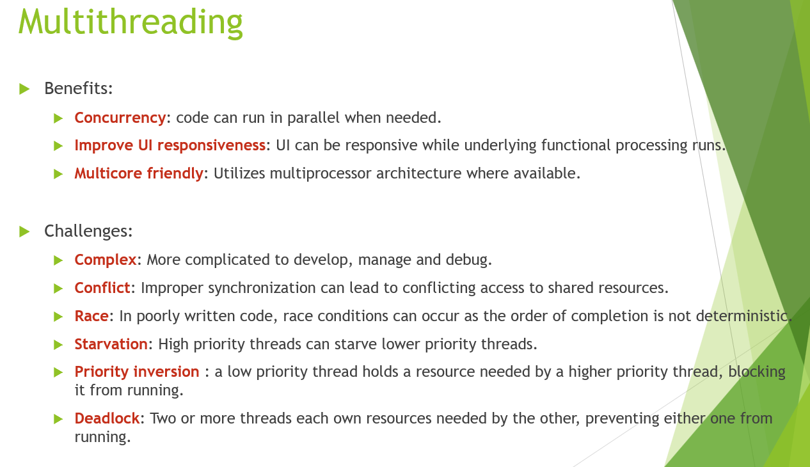

# Processes, Threads, IPC [↩](../Contents/SE.md)

## Process
- Provides resoures to exec a program.
- Has :
    - Virtual address space
    - Executable code
    - Open handles to system objects
    - Security Context
    - Unique Process identifier
    - Environment variables
    - Priority Class
    - Max,Min working set sizes
    - At least 1 thread of execution
- Started with *Primary thread* but can create additional threads.

## Thread
- Entity within a process that can be scheduled for execution.
- All threads share virtual address space and system resources.
- It has its own exception handlers, scheduling priority, local storage, unique identifier, and set of structures for state storage.
- Specific to one process.
- Pointers are **process-specific** so threads can share pointers.

## Process vs Thread

## Thread states
- Running thread enters blocked/suspended state if it's blocked on waiting for some system resource, or its time splice expires.
- Blocked/Suspended threads become ready to run when the resource they wait on becomes available or when their sleep interval has expired.

## Thread Features
- Managed threads : Interface to schedule and access threads over OS threads.
- Priority : Higher priority threads are preferred while scheduling.
- Foreground and Background Threads : Background threads do not keep the managed execution environment running. Once all foreground threads have been stopped in a managed process, so are the background threads.
- Thread Pool : Provides an app with a pool of worker threads that are managed by the system. Promotes concentration on app tasks.

## Multithreading
