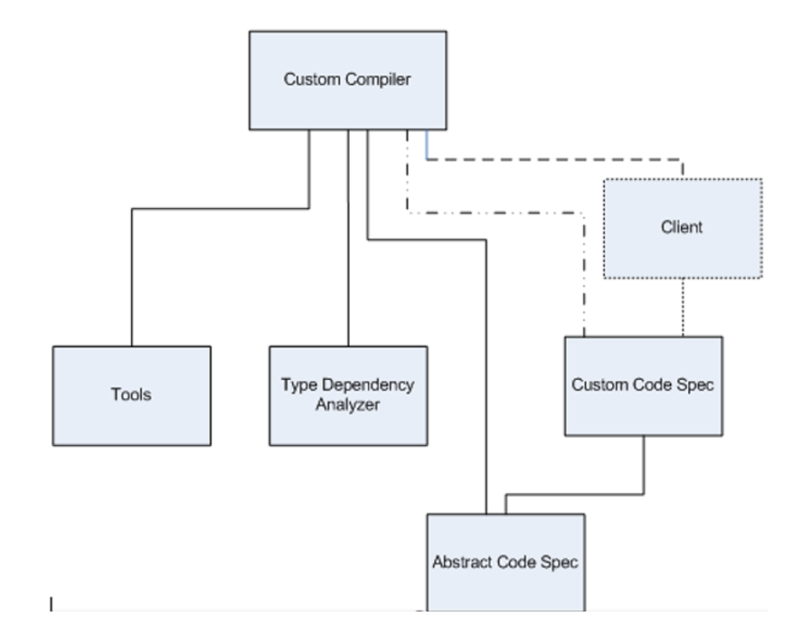

# Unified Modelling Language (UML) [↩](../Contents/SE.md)
- Visualizes architecture and design of a software system.

- **Common types of UML diagrams:**
    - `Module` diagram
    - `Class` diagram
    - `Activity` diagram

## Module Diagram
- Shows the various modules in the software project and their dependancies.
- `No cyclic dependancy`.
- Lower level modules **may not depend** on upper level modules.
- Each module has a specific function and interacts with other modules on a **need-to-know** basis.

## Class Diagram
- Shows relations between various types of classes in the software project.

## Activity Diagram
- Basically a flow chart that shows the sequence of activities between the various components in the software project.